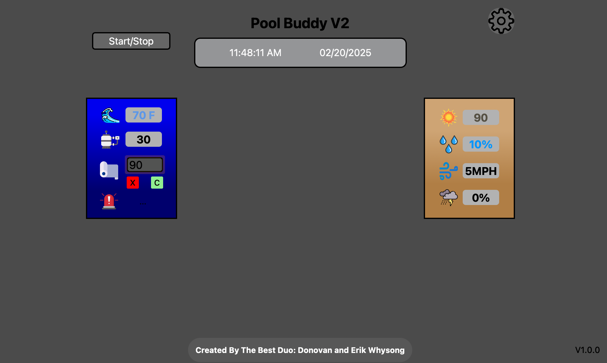

#  Poolbuddy V2

A Python app that runs on Raspberry Pi, monitoring pool temperature, outside temperature and other weather data.



-----

## Table of Contents

- [Features](#features)
- [Compatibility](#compatibility)
- [Setup](#setup)
- [Run](#run)
- [Usage](#usage)
- [Contributing](#contributing)
- [License](https://github.com/donnie58744/Pool-Buddy-V2/blob/main/LICENSE)

### Features

- Pool data
    - Pool temperature
    - Days until next filter change
- Weather data
    - Outside temperature
    - Humidity Percentage
    - Wind Speed
    - Chance Of Rain
- Email notifications on data **Multiple Recipients Allowed!**

- Remote motoring of pool and weather data from [QuackyOS](https://QuackyOS.com?openWindow=Poolbuddy)

### Compatibility

- Raspberry PI

### Setup

#### Enable One-Wire Interface

```bash
    sudo nano /boot/config.txt
```

- Add this to the bottom of the file

    ```bash
    dtoverlay=w1-gpio
    ```

- Exit and reboot

- Login and enter

    ```bash
    sudo modprobe w1-gpio
    sudo modprobe w1-therm
    ```

    

- Settings

    - Click the gear gog on from the main screen

    

### Run

- `python3 main.py`

### Usage

- **Must have a [QuackyOS](https://QuackyOS.com) Account**
- Set a temperature limit for the pool cover. This will send a email notification when pool temperature is equal to or greater than the specified value.
- Settings
    - Add multiple emails to the **Emailer list**
    - Set **OWM API** Key
        - Set a **Location**
        - Set **Temperature Unit**
    - Make sure a **Seriel Number** was generarted on launch
    - Set **Water Sensor** location
        - Make sure to [Enable One Wire Interface](#Enable-One-Wire-Interface)
        - Default Location is `/sys/bus/w1/devices/xxxxxxxx`
        - Select device
        - Done!
    - Set a **Reset Switch Pin** and a **Reset LED Pin**

### Contributing

- Donovan Whysong ([Afghan Coder](https://github.com/donnie58744)) - Head Of Programming
- Erik Whysong - Head Of Engineering

### License

- View [Here](https://github.com/donnie58744/Pool-Buddy-V2/blob/main/LICENSE)